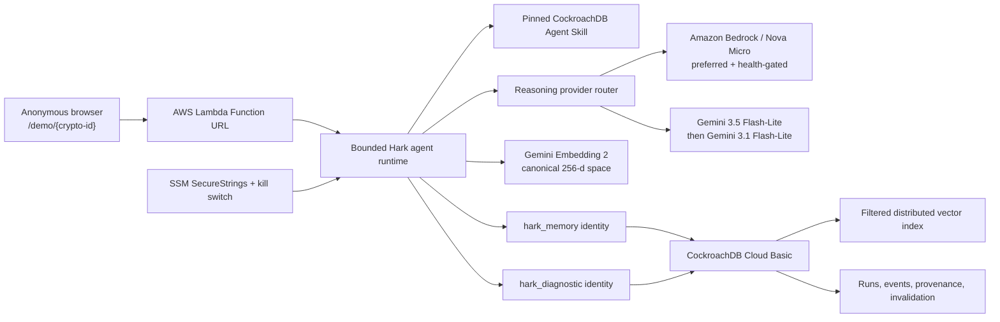

# Hark

**Execution memory for Agent Skills.** Hark turns a real agent run—including failures, recovery steps, evidence, and diagnosis—into scoped experience that can make the next related run faster and more reliable. It changes neither the Skill nor the model weights.

[Live application](https://sdzlkokjx52kzobxgsl74riswa0afbzv.lambda-url.us-east-1.on.aws/) · [CockroachDB × AWS Hackathon](https://cockroachdb-ai.devpost.com/) · [Setup, operations, and teardown](SETUP.md)

> **Verified production status — 18 August 2026:** the public AWS application, real Gemini inference, CockroachDB Cloud persistence, restricted identities, distributed vector retrieval, failure recovery, provenance, and invalidation are live. A production first run and differently worded related run both succeeded; the related run recalled the first run's experience at cosine similarity `0.757532`, used one fewer tool call, avoided the known permission failure, and completed about 1.92 seconds faster. Amazon Bedrock is integrated as the preferred reasoning route, but this AWS account currently reports `NOT_AUTHORIZED`, so the verified pair used the Gemini fallback. No Bedrock success is claimed.

## Why Hark

Agent Skills encode reusable procedure. They do not automatically remember that a particular environment denied a preflight, which safe alternative worked, or which evidence supported the final diagnosis. Chat history is a weak substitute: it is unstructured, difficult to scope, difficult to invalidate, and detached from the execution evidence that produced it.

Hark adds a governed memory plane around one deliberately narrow workflow: diagnosing a CockroachDB orders-query regression with the official [`profiling-statement-fingerprints`](https://github.com/cockroachlabs/cockroachdb-skills/tree/e14e86d23ce8ee2e7e40a34ce2944c2502b6eadd/skills/cockroachdb-observability-and-diagnostics/profiling-statement-fingerprints) Agent Skill.

## First run → related run

On the first run, no matching experience exists.

1. Hark loads the pinned official Skill.
2. It embeds the task as a `RETRIEVAL_QUERY` with Gemini Embedding 2 at 256 dimensions and searches only active, successful experience in the same demo, Skill, environment, and workflow.
3. A restricted diagnostic identity tries a cluster-setting preflight. CockroachDB rejects it with SQLSTATE `42501` because the role lacks `VIEWCLUSTERSETTING`.
4. The agent recovers without privilege escalation using the Skill's production-safe `crdb_internal.statement_statistics` view, `EXPLAIN`, and index metadata.
5. Hark persists the evidence-grounded diagnosis, failure fingerprint, safe recovery, provenance, and a canonical `RETRIEVAL_DOCUMENT` embedding.

The differently worded related run searches before acting. At the configured `0.73` threshold, the first run's experience is injected as a compact brief. The known denied preflight is skipped, while the run remains evidence-producing and links back to the exact experience that influenced it. A deterministic failure fingerprint is also available as a reactive recovery path when semantic retrieval is not sufficient.

## Architecture



The framework-free frontend and JSON API are served by one Python 3.12 Lambda. CloudFormation owns the runtime role, Function URL policy, environment limits, and stack outputs. A private S3 bucket holds versioned deployment packages; CloudWatch receives Lambda logs.

## CockroachDB integration

Hark uses two named competition technologies:

- **Agent Skills Repo:** the runtime loads an exact pinned copy of `profiling-statement-fingerprints` v1.0 from Cockroach Labs commit `e14e86d23ce8ee2e7e40a34ce2944c2502b6eadd`.
- **Distributed Vector Indexing:** `hark.experiences.embedding` is `VECTOR(256)`. `experiences_memory_vector_idx` uses `vector_cosine_ops`, with `demo_id`, `skill_id`, `environment_id`, and `workflow` as exact prefix filters.

CockroachDB also stores anonymous demos, immutable run/event evidence, derived experience, run-to-experience links, structured failure recoveries, provider-budget reservations, concurrency leases, and invalidation state. The diagnostic role can read only fixed demo tables and production-safe metadata. A separate memory role owns the memory lifecycle.

## Provider resilience and canonical memory

Reasoning follows a bounded route:

1. Amazon Bedrock Nova Micro, only when the account-level availability API reports authorization; the result is cached for five minutes.
2. Gemini 3.5 Flash-Lite.
3. Gemini 3.1 Flash-Lite, only for recognized provider failures from the primary route.

Invalid requests are surfaced instead of being disguised as provider outages. Each reasoning response records the provider and model actually used.

All memory vectors—queries and documents—come from `gemini-embedding-2` at exactly 256 dimensions. The application rejects an unexpected shape. The production environment ID includes the model family and dimension, which prevents incompatible older vectors from entering retrieval.

## Security and cost boundaries

- User text never becomes SQL; the diagnostic surface has exactly four fixed read-only operations.
- The diagnostic identity cannot write demo or memory data, and the real production check confirmed that boundary.
- Lambda reads only three named SSM parameters. The Google API key is held in a SecureString, not in code, Lambda environment variables, the browser, or Git.
- Bedrock IAM is limited to `GetFoundationModelAvailability` and Nova Micro inference.
- Server-side CockroachDB reservations enforce daily and per-minute Gemini request caps across warm Lambda instances.
- Gemini 3.5 reasoning: 200 requests/day and 12 requests/minute.
- Gemini 3.1 reasoning: 100 requests/day and 12 requests/minute.
- Gemini Embedding 2: 150 requests/day and 90 requests/minute.
- Product limits: 4 runs/demo/rolling day, 40 runs/UTC day, 1,000 lifetime runs, 3 concurrent leases, 5 agent iterations, and a 60-second application deadline.
- A fail-closed SSM kill switch can stop new execution while leaving evidence readable.
- CSP, HSTS, frame denial, content-type protection, referrer, and browser-permission headers are enabled.
- Demo links expire after 45 days.

## Verified production evidence

Acceptance demo: [`/demo/ZnGIi4hehPOyM354yuEkxUrUrldivqca`](https://sdzlkokjx52kzobxgsl74riswa0afbzv.lambda-url.us-east-1.on.aws/demo/ZnGIi4hehPOyM354yuEkxUrUrldivqca)

| Result | First run | Related run |
| --- | ---: | ---: |
| Run ID | `fd1060ea-33b4-46be-b14b-b8fcf76b4a9e` | `2effdc30-96d3-42b5-a521-be3ae1d2f6da` |
| Status | succeeded | succeeded |
| Duration | 8,850.57 ms | 6,930.55 ms |
| Diagnostic tools | 4 | 3 |
| Tool failures | 1 (`42501`) | 0 |
| Memory used | no | yes |
| Recalled similarity | — | `0.757532` |
| Reasoning route | Gemini 3.5 Flash-Lite | Gemini 3.5 Flash-Lite |

The related run points to experience `0f1d2c22-db08-469c-99bc-df6b58415dc4`, whose source is the first run. CockroachDB recorded a proactive use link at raw similarity `0.75753195` and incremented `times_used` to 1.

Additional checks:

- 17 local unit/API/provider-routing/real-CockroachDB tests passed.
- The production database verifier passed all 13 checks: connectivity, both identities, denied diagnostic writes, real SQLSTATE `42501`, official-Skill statistics, `EXPLAIN`, index metadata, vector index presence, vector retrieval, deterministic recovery, invalidation, and exclusion after invalidation.
- `/health` returned `{"status":"ok","database":true}`.
- Chrome verified landing, fresh investigation, persisted direct URL, first/related comparison, memory provenance, responsive mobile layout, no horizontal overflow, and no console errors or warnings.
- Real model probes succeeded for Gemini 3.5, Gemini 3.1, a 256-dimensional Gemini Embedding 2 response, and Gemini function calling.

## Honest Bedrock status

The live AWS availability API currently reports agreement, entitlement, and region as `AVAILABLE` but `authorizationStatus: NOT_AUTHORIZED` for Nova Micro. A direct runtime probe returns `ValidationException: Operation not allowed`.

Hark therefore skips a known-unavailable Bedrock route during its five-minute health window and continues through the bounded Gemini fallback. If AWS authorizes the account later, the same router will prefer Bedrock automatically. The exact check and support handoff are in [SETUP.md](SETUP.md#bedrock-operation-not-allowed).

## Repository map

```text
backend/     Lambda handler, provider router, agent harness, schema, pinned Skill
frontend/    Responsive public product UI
infra/       CloudFormation production stack
scripts/     Bootstrap, package, deploy, and real-service verification
tests/       Unit, API, provider-routing, and CockroachDB integration tests
```

## License

Apache License 2.0. The vendored Agent Skill remains attributable to its Cockroach Labs upstream source and pinned commit.
