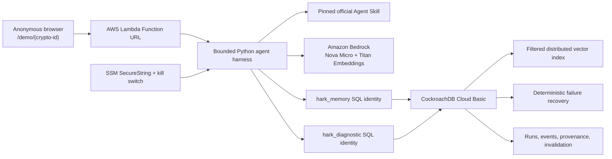

# Hark

**Execution memory for Agent Skills.** Hark turns real outcomes, failures, and recoveries into scoped experience that can improve the next run—without changing the Skill or retraining the model.

[Live production site](https://sdzlkokjx52kzobxgsl74riswa0afbzv.lambda-url.us-east-1.on.aws/) · [CockroachDB × AWS Hackathon](https://cockroachdb-ai.devpost.com/) · [Setup and teardown](SETUP.md)

> **Verified production status — 18 August 2026:** the public AWS site, anonymous demo creation, CockroachDB Cloud persistence, restricted identities, real permission boundary, vector index/search, failure-fingerprint recall, provenance, and invalidation are live and verified. Amazon Bedrock runtime calls are currently blocked at the AWS account level with `ValidationException: Operation not allowed`. Hark reports this honestly and does not fabricate a diagnosis. Therefore, the deployed Cold → Warm inference story is not yet verified end to end. See [Current limitation](#current-limitation).

## The problem

Agent Skills encode procedure, but a new execution often repeats environment-specific mistakes from earlier runs. Chat history is a poor substitute: it is unstructured, difficult to scope, difficult to invalidate, and weakly connected to the evidence that produced it.

Hark adds an execution-memory layer around one deliberately narrow workflow: diagnosing a CockroachDB orders-query regression with the official [`profiling-statement-fingerprints`](https://github.com/cockroachlabs/cockroachdb-skills/tree/e14e86d23ce8ee2e7e40a34ce2944c2502b6eadd/skills/cockroachdb-observability-and-diagnostics/profiling-statement-fingerprints) Agent Skill.

## Cold → Warm

The first run has no precedent.

1. Hark loads the pinned official Skill.
2. It searches active, successful experience in the same anonymous demo, Skill, environment, and workflow.
3. A restricted diagnostic identity tries a cluster-setting preflight and CockroachDB rejects it with SQLSTATE `42501` because the role lacks `VIEWCLUSTERSETTING`.
4. The agent recovers without privilege escalation: it uses the Skill's production-safe `crdb_internal.statement_statistics` view, `EXPLAIN`, and index metadata.
5. The diagnosis, failure fingerprint, recovery, evidence lineage, and Titan embedding are persisted as derived experience.

The differently worded Warm run searches first. A sufficiently similar experience is injected as a compact brief, the known preflight failure is skipped, and the run links back to the exact experience that influenced it. If semantic recall misses, the deterministic failure fingerprint provides a reactive second path.

No run is presented as successful unless Bedrock produced a diagnosis and the recorded tool evidence supports it.

## Architecture



The frontend is framework-free HTML, CSS, and JavaScript served by the same Lambda as the JSON API. This keeps the dependency and attack surfaces small. CloudFormation owns the Lambda, its public Function URL policy, the runtime role, environment limits, and outputs.

## CockroachDB integration

Hark genuinely uses two competition technologies:

- **Agent Skills Repo:** the runtime loads an exact pinned copy of `profiling-statement-fingerprints` v1.0 from Cockroach Labs commit `e14e86d23ce8ee2e7e40a34ce2944c2502b6eadd`.
- **Distributed Vector Indexing:** `hark.experiences.embedding` is `VECTOR(256)`. `experiences_memory_vector_idx` uses `vector_cosine_ops`, with `demo_id`, `skill_id`, `environment_id`, and `workflow` as exact prefix filters.

CockroachDB also stores anonymous demos, immutable run/event evidence, derived experiences, run-to-experience links, structured failure recoveries, usage leases, and invalidation state. The diagnostic role can only read the fixed demo tables and production-safe metadata; a separate memory role owns the memory lifecycle.

## AWS integration

- **AWS Lambda:** public HTTPS application and bounded API runtime.
- **Amazon Bedrock:** Nova Micro (`amazon.nova-micro-v1:0`) for tool selection and evidence-grounded diagnosis; Titan Text Embeddings v2 (`amazon.titan-embed-text-v2:0`) at 256 dimensions for semantic memory.
- **AWS Systems Manager Parameter Store:** encrypted database URLs and a fail-closed execution kill switch.
- **AWS CloudFormation:** reproducible least-privilege infrastructure.
- **Amazon S3:** private deployment artifact bucket.
- **Amazon CloudWatch Logs:** Lambda runtime logs through the AWS-managed basic execution policy.

The code calls real Bedrock APIs; there is no alternate provider or fixture path in production. The current account restriction is documented below.

## Memory quality and governance

- Structured scope is applied before vector ranking.
- Only successful, active experience is eligible for retrieval.
- Cosine similarity must meet the configured `0.72` threshold.
- Unrelated and weak synthetic vectors were verified as no-match cases against real CockroachDB.
- Deterministic SHA-256 failure fingerprints cover Skill, environment, operation, SQLSTATE, and category.
- Every experience points to its source run; every later use is an explicit link.
- Invalidation preserves audit history while immediately excluding the memory from both retrieval paths.
- Anonymous demo IDs are 192-bit cryptographic values, encoded as 32 URL-safe characters.

## Security and cost boundaries

- User text never becomes SQL. The diagnostic surface contains exactly four fixed, read-only operations.
- The diagnostic identity cannot write demo data or memory data; this was verified against production CockroachDB.
- The Lambda runtime can read only the two Hark SSM parameters and invoke only the configured Nova/Titan model resources.
- CSP, HSTS, frame denial, content-type protection, referrer, and browser-permission headers are enabled.
- Per-demo limit: 4 runs per rolling 24 hours.
- Global limits: 200 runs per UTC day and 1,000 lifetime runs.
- Database-backed concurrent execution leases: 3.
- Agent tool iterations: 5; application timeout: 60 seconds; Lambda timeout: 90 seconds.
- Fail-closed SSM kill switch: `/hark/prod/execution-enabled`.
- Demo links expire after 45 days.
- CockroachDB Basic is capped in the Cloud console at 60 million RUs and 6 GiB (a $15 monthly hard cap at configuration time).
- The AWS account currently has a 10-concurrent-execution account limit; Hark does not reserve concurrency because AWS requires all 10 to remain unreserved. The database lease still caps active Hark executions at 3.

## Verified evidence

- 8 unit/API/real-local-CockroachDB tests passed from the checked-in suite.
- Production database verifier passed 13 checks: connectivity, both identities, denied diagnostic writes, SQLSTATE `42501`, Skill statistics query, EXPLAIN, index metadata, vector index presence, vector retrieval, deterministic recall, invalidation, and exclusion after invalidation.
- The deployed `/health` endpoint returned `{"status":"ok","database":true}`.
- The live landing page returned HTTP 200 with its CSP; anonymous demo creation returned a 32-character ID.
- Chrome verified the live landing page, demo workspace, persisted failed-run trace, and truthful Bedrock failure UI.
- A real production Bedrock probe did **not** pass; both embedding and conversation remain blocked by the account restriction.

## Current limitation

AWS Bedrock Runtime returns `ValidationException: Operation not allowed` for both the documented Nova Micro and Titan Text Embeddings v2 model IDs in `us-east-1`. Model catalog availability, region, IAM `bedrock:InvokeModel`, and direct runtime probes were checked. The hackathon manager's [answer to the same error](https://cockroachdb-ai.devpost.com/forum_topics/44642-operation-not-allowed-error) directs entrants to AWS Support when access and IAM are already correct.

Until AWS removes that account-specific restriction:

- Hark remains publicly reachable and CockroachDB-backed.
- New runs persist a truthful `BEDROCK_UNAVAILABLE` event and no diagnosis.
- No embedding, derived experience, or Cold → Warm performance result is fabricated.
- A real measured Cold-versus-Warm production comparison is unavailable.

The exact support request and post-unblock verification commands are in [SETUP.md](SETUP.md#bedrock-operation-not-allowed).

## Repository

```text
backend/     Lambda handler, agent harness, CockroachDB store, schema, pinned Skill
frontend/    Responsive public product UI
infra/       CloudFormation production stack
scripts/     Bootstrap, package, deploy, and real-service verification
tests/       Unit, API, and CockroachDB integration tests
```

For local setup, deployment, operation, troubleshooting, and teardown, use [SETUP.md](SETUP.md).

## License

Apache License 2.0. The vendored Agent Skill remains attributable to its Cockroach Labs upstream source and pinned commit.
