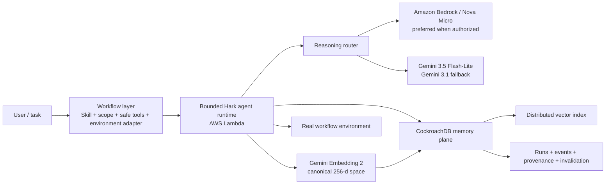

# Hark

**Execution memory for Agent Skills.** Hark turns what happened during a real agent run—evidence, failures, recoveries, successful paths, and outcomes—into scoped experience that can improve the next related run without rewriting the Skill or retraining the model.

[Live application](https://sdzlkokjx52kzobxgsl74riswa0afbzv.lambda-url.us-east-1.on.aws/) · **[Add your workflow](ADD_WORKFLOW.md)** · [Setup & operations](SETUP.md) · [CockroachDB × AWS Hackathon](https://cockroachdb-ai.devpost.com/)

> **Extend Hark:** connect a Skill, give it a stable workflow/environment scope, expose the safe tools it is allowed to use, and connect those tools to the real target environment. Hark keeps the same execution-memory loop underneath: scoped recall, immutable run evidence, failure/recovery memory, provenance, vector retrieval, and invalidation. See **[ADD_WORKFLOW.md](ADD_WORKFLOW.md)** for the shortest path, including a ready-to-use coding-agent prompt.

## Why Hark

Agent Skills encode reusable procedure: what an agent should do. They do not automatically preserve what execution taught the agent in a specific environment.

That missing experience is often the most valuable part of a run:

- which permission boundary blocked a normal step,
- which recovery path worked,
- which tool sequence produced useful evidence,
- which path should be avoided next time,
- and which prior execution actually influenced a later decision.

Chat history is a weak substitute. It is difficult to scope, difficult to invalidate, and usually detached from the evidence that produced it.

Hark adds a governed **execution-memory plane** around Agent Skills.

```text
Agent Skill + environment + safe tools
                │
                ▼
          Hark execution
                │
        evidence / outcome
                │
                ▼
      CockroachDB memory plane
        ├─ immutable run events
        ├─ derived experience
        ├─ vector retrieval
        ├─ failure recovery
        ├─ source/use provenance
        └─ invalidation
                │
                ▼
       next related execution
```

The live application demonstrates this architecture through CockroachDB query-regression diagnosis using the official [`profiling-statement-fingerprints`](https://github.com/cockroachlabs/cockroachdb-skills/tree/e14e86d23ce8ee2e7e40a34ce2944c2502b6eadd/skills/cockroachdb-observability-and-diagnostics/profiling-statement-fingerprints) Agent Skill.

For the hackathon, we focused the production deployment and verification on one complete workflow so the memory behavior could be measured end to end. The **memory model is not tied to query regression**: additional workflows can define different Skills, scopes, tools, and environment adapters while reusing the same Hark memory semantics. See [Add your workflow](ADD_WORKFLOW.md).

## The Hark memory loop

### 1. Search before acting

Before a run begins, Hark embeds the incoming task and searches only experience with the same Skill, workflow, environment, status, and active-memory scope.

### 2. Execute the Skill with bounded tools

The Skill provides procedure. The workflow exposes an explicit tool surface. The reasoning model can choose among those tools, but it cannot invent tool output or escape the workflow's trust boundary.

### 3. Record what actually happened

Hark stores immutable execution events, evidence, failures, recovery decisions, the final diagnosis/outcome, and provider provenance.

### 4. Derive experience

A successful run produces compact execution experience: what happened, what worked, what failed, what to avoid, and where the evidence came from.

### 5. Carry relevant experience forward

A later related task retrieves that experience through CockroachDB vector search. The experience is injected as a compact brief, while the new run still gathers fresh evidence.

### 6. Keep influence auditable

Every experience points back to its source run. Every later use is recorded explicitly. Memory can be invalidated without deleting its audit history.

## Production example: first run → related run

The included CockroachDB workflow shows the full loop with real database behavior.

On the first run:

1. Hark loads the pinned official Skill.
2. It generates a 256-dimensional canonical query embedding and searches scoped prior experience.
3. No matching experience exists.
4. A restricted diagnostic identity attempts the Skill's cluster-setting preflight.
5. CockroachDB rejects that operation with real SQLSTATE `42501` because the role lacks `VIEWCLUSTERSETTING`.
6. Hark continues without privilege escalation through production-safe statement statistics, `EXPLAIN`, and index metadata.
7. The diagnosis, failure fingerprint, recovery path, provenance, and canonical experience embedding are persisted.

On the related run:

1. The task is worded differently.
2. Hark searches memory before acting.
3. The first run's experience clears the configured similarity threshold.
4. The known denied preflight is omitted from the useful path.
5. The agent still gathers fresh evidence and produces a new diagnosis.
6. CockroachDB records the exact experience that influenced the run.

### Verified production result

| Result | First run | Related run |
| --- | ---: | ---: |
| Run ID | `fd1060ea-33b4-46be-b14b-b8fcf76b4a9e` | `2effdc30-96d3-42b5-a521-be3ae1d2f6da` |
| Status | succeeded | succeeded |
| Duration | 8,850.57 ms | 6,930.55 ms |
| Diagnostic tools | 4 | 3 |
| Tool failures | 1 (`42501`) | 0 |
| Memory used | no | yes |
| Recalled similarity | — | `0.757532` |
| Reasoning route | Gemini 3.5 Flash-Lite | Gemini 3.5 Flash-Lite |

The related run used experience `0f1d2c22-db08-469c-99bc-df6b58415dc4`, sourced from the first run. CockroachDB recorded the proactive use link at raw similarity `0.75753195` and incremented its later-use count.

Acceptance investigation: [`/demo/ZnGIi4hehPOyM354yuEkxUrUrldivqca`](https://sdzlkokjx52kzobxgsl74riswa0afbzv.lambda-url.us-east-1.on.aws/demo/ZnGIi4hehPOyM354yuEkxUrUrldivqca)

## Add your own workflow

A Hark workflow contributes four workflow-specific pieces:

1. **Skill** — the `SKILL.md` or equivalent procedure.
2. **Scope** — stable `skill_id`, `workflow`, and `environment_id` values.
3. **Safe tools** — the explicit operations available to the agent.
4. **Environment adapter** — the code that executes those operations against the real system and returns structured evidence.

Everything below that boundary can keep the same Hark semantics:

- scoped vector recall,
- immutable run events,
- experience derivation,
- deterministic failure recovery,
- run-to-experience provenance,
- memory invalidation,
- provider routing and budgets.

That means a Hark deployment can be extended with workflows for areas such as Kubernetes incident response, CI/CD diagnosis, security triage, repository maintenance, data operations, or other Agent Skill-driven tasks while keeping memory isolated by workflow and environment.

The quickest route is to let a coding agent inspect the existing production workflow and implement another one by following the same contract. The manual path is documented too.

**→ [Read ADD_WORKFLOW.md](ADD_WORKFLOW.md)**

## Architecture



The framework-free frontend and JSON API are served by one Python 3.12 Lambda. CloudFormation owns the runtime role, Function URL policy, environment limits, and stack outputs. A private S3 bucket stores versioned deployment packages, SSM Parameter Store holds production configuration/secrets, and CloudWatch receives Lambda logs.

## CockroachDB integration

Hark meaningfully integrates two named competition technologies:

- **Agent Skills Repo** — the production workflow loads an exact pinned copy of `profiling-statement-fingerprints` v1.0 from Cockroach Labs commit `e14e86d23ce8ee2e7e40a34ce2944c2502b6eadd`.
- **Distributed Vector Indexing** — `hark.experiences.embedding` is `VECTOR(256)`, with cosine retrieval scoped by demo, Skill, environment, and workflow before ranking.

CockroachDB is also Hark's durable execution-memory system. It stores runs, immutable events, derived experiences, source/use links, structured failure recoveries, usage reservations, concurrency leases, and invalidation state.

## Provider resilience

Reasoning follows a bounded route:

1. **Amazon Bedrock Nova Micro** — preferred primary whenever the AWS account-level availability check reports the model authorized.
2. **Gemini 3.5 Flash-Lite** — automatic fallback when the preferred route is unavailable.
3. **Gemini 3.1 Flash-Lite** — tertiary fallback for recognized provider failures.

Bedrock health is cached so a known-unavailable route does not add latency to every call. If account authorization becomes available, Hark automatically returns to Bedrock as the preferred reasoning provider without changing the workflow or memory layer.

Semantic memory deliberately does **not** switch embedding spaces with the reasoning provider. All query/document memory vectors use `gemini-embedding-2` at exactly 256 dimensions, preserving comparability across runs.

The verified production pair above used the Gemini reasoning fallback. Bedrock verification and account-level troubleshooting are documented in [SETUP.md](SETUP.md#bedrock-operation-not-allowed).

## Safety and bounded execution

The included production workflow demonstrates Hark's trust-boundary approach:

- user text never becomes arbitrary SQL,
- the diagnostic role is read-only,
- only four fixed diagnostic operations can reach CockroachDB,
- the role cannot write Hark memory or demo data,
- execution is bounded by run, concurrency, iteration, provider, and timeout limits,
- a fail-closed SSM kill switch can stop new runs while leaving existing evidence readable,
- invalidated memory is immediately excluded from both retrieval paths while provenance remains auditable.

Additional workflows should preserve the same principle: **the Skill may guide the agent, but the workflow controls what the agent is actually allowed to do.**

## Verification

The frozen production build was checked with:

- 17 local unit/API/provider-routing/real-CockroachDB tests,
- 13 production database checks covering both identities, denied writes, real SQLSTATE `42501`, official-Skill statistics, `EXPLAIN`, index metadata, vector retrieval, deterministic recovery, provenance, and invalidation,
- real Gemini 3.5, Gemini 3.1, function-calling, and 256-dimensional embedding probes,
- live `/health` database verification,
- desktop and mobile Chrome QA with no console errors or horizontal overflow.

## Repository map

```text
backend/          Lambda handler, provider router, agent harness, schema, included Skill
frontend/         Responsive public product UI
infra/            CloudFormation production stack
scripts/          Bootstrap, package, deploy, and real-service verification
tests/            Unit, API, provider-routing, and CockroachDB integration tests
ADD_WORKFLOW.md   Add another Skill/workflow/environment to Hark
SETUP.md          Local setup, deployment, verification, operations, teardown
```

## License

Apache License 2.0. The vendored CockroachDB Agent Skill remains attributable to its upstream source and pinned commit.